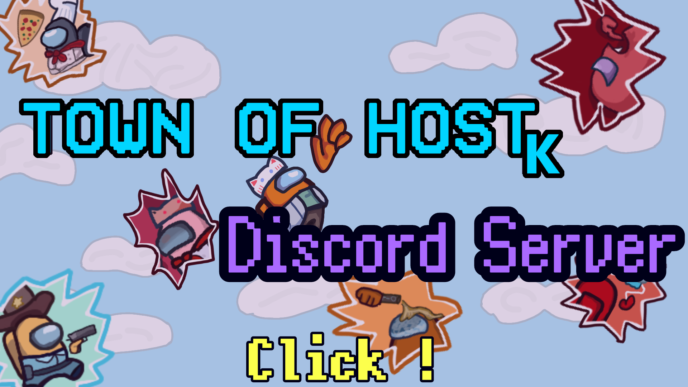

# Town Of Host-K

!これは、英語版のReadmeです! 

**DiscordServer**

# Regarding this mod
This mod is not affiliated with Among Us or Innersloth LLC, and the content contained therein is not endorsed or otherwise sponsored by Innersloth LLC. Portions of the materials contained herein are property of Innersloth LLC. © Innersloth LLC. 

Please do not contact the official support regarding issues with this mod. 

This mod adds roles, features, and other elements to TownOfHost. 
If you encounter bugs in TownOfHost-K, please report them to TownOfHost-K first, not to the original game or other mods. 

Additionally, questions and bug reports regarding TownOfHost-K are accepted on the [DiscordServer](https://discord.gg/5DPqH8seFq). 

## [Wiki](https://github.com/KYMario/TownOfHost-K/wiki)

## Release
AmongUs version : **17.0.0**~ 

**The latest version is[Here](https://github.com/KYMario/TownOfHost-K/releases/latest)** 
Previous versions are [Here](https://github.com/KYMario/TownOfHost-K/releases) 

## About Public Rooms
> [!Note]
> In the version, you cannot open public rooms on vanilla servers via the official Among Us client. 

> [**Note**]
> - 【Reason】 
> - We believe the main cause is the numerous inquiries received by AmongUs official regarding specifications and bugs in HostMod (including Mode) rooms. 
> - We are also issuing a warning to prevent users from experiencing **unintended Mod experiences**. 

- This is not a permanent change. 
- It does not affect private rooms. 
- It does not affect custom servers. 
● Please refrain from contacting us regarding issues like being unable to open public rooms. 

## Opening recruitment rooms, recruiting, or joining via recruitment is strictly prohibited.
**Prohibited Actions** 
> [**Note**]
> - ・Creating a private Mod room and sharing its access code in a public room, potentially allowing public room users to join that private room.
> - (Examples)
> - Room owners creating public rooms using sub-accounts and recruiting users to private rooms from there.
> - Participants creating public rooms using sub-accounts and recruiting users to private rooms from there.
> - Room owners or participants joining public rooms and recruiting users to private rooms from there.

=> This is to prevent public room users from experiencing unintended Mod activities. 

**Permitted Activities**
> [**Note**]
> - Sharing private room codes in Discord to host Mod rooms among friends
> - via Town Of Host-K matchmaking
> - Participatory/private village streams on YouTube or similar platforms that do not involve the above prohibited activities 

=> In short, it is a violation if there is a possibility that **random players unaware of the Mod's existence might join**. 
 
If you encounter a recruitment room, do not join it indiscriminately. Please notify the developers first. We will handle it strictly. 

## Punishments and Usage Restrictions in TOH-K
Starting with version 5.1.61.1, we have implemented the blacklist functionality used in certain MODs, such as [SuperNewRoles](https://github.com/SuperNewRoles/SuperNewRoles/), into Town Of Host-K.

> [!note]
> - [Punishable Acts]
> - ・Actions equivalent to the aforementioned recruitment rooms or recruitment behavior
> - ・Disruptive behavior deemed inappropriate and punishable by the developers

Players engaging in the above will be added to the blacklist at the MOD developers' discretion. 
**Participation in or hosting of rooms using MODs that apply the blacklist will be permanently or temporarily restricted.** 

**★Note: Friend codes are now required to create rooms.★** 

-----------------------------------------------

**【You Must Read This】** 
By using Town Of Host-K, you pledge not to engage in any actions listed under “Punishable Usage Methods”. 
Should you engage in punishable usage, you agree to accept punishment under any circumstances. 

-----------------------------------------------

In short, 
if you engage in any of the actions listed in the [Punishable Usage Methods] above, 
you will lose access to the mod! 
If you use this mod, you must accept losing access to it, 
and you must not engage in any punishable usage methods!! 

## What is TownOfHost-K?
It's a mod packed with innovative and unique features and roles that sets it apart from other Among Us mods.

As a HostMod, only the room owner needs to install the mod.
Players don't need to install anything or go through the hassle of adding custom servers.
Simply join the room created by the installer to play TownOfHost-K!

Detailed specifications can be found on the [Wiki](https://github.com/KYMario/TownOfHost-K/wiki) or checked in-game.

## About Roles
There are quite a few roles, so please check the [Wiki](https://github.com/KYMario/TownOfHost-K/wiki).

## About Features and Modes

Modes

- [Standard](https://github.com/KYMario/TownOfHost-K/wiki/Standard)
- - [Hide and Seek with Roles](https://github.com/KYMario/TownOfHost-K/wiki/HideandSeekwithRoles)
- - [Sudden Death Mode](https://github.com/KYMario/TownOfHost-K/wiki/SuddenDeath)
- [Hide and Seek](https://github.com/KYMario/TownOfHost-K/wiki/HideandSeek)
- [Task Battle](https://github.com/KYMario/TownOfHost-K/wiki/TaskBattle)

For other features and changes, please refer to the main wiki.

**Note**
- Please enable the text-to-speech setting only when (棒読みちゃん)Bōyomi-chan is running (it will automatically turn off).

#### External Links
　TownOfHost-K 
　　[Twitter(X)](https://x.com/Tohkserver_k) 

**TownOfHost-K Developer** 
　ky 
　　[Youtube](https://www.youtube.com/@MTGC_KY) 
　　[Twitter(X)](https://x.com/ky_mario_ky) ・ [Bluesky](https://bsky.app/profile/kymario.bsky.social) 

　ToraTiger 
　　[Youtube](https://www.youtube.com/@torataiga-) 
　　[Twitter(X)](https://x.com/TVppJ90s9G2sPkq) ・ [Bluesky](https://bsky.app/profile/taiga1.bsky.social) 

　Yoran 
　　[YouTube](https://www.youtube.com/@Yoran_Furan) 
　　[Twitter(X)](https://x.com/Yoran_FuranOshi) ・ [Bluesky](https://bsky.app/profile/yoran-furanoshi.bsky.social) 

　nemuA 
　　[Twitter(X)](https://x.com/nemu_adatoomou) 

　Harron 
　　[Twitter(X)](https://x.com/HellWeen11) 

　RixiRixi 
　　[Twitter(X)](https://x.com/rixirixi0202) 

※The developer of the original TownOfHost is omitted here.

#### Credits
[Town Of Host](https://github.com/tukasa0001/TownOfHost) 
　This is the original project from which we forked. Most features available in TownOfHost are also implemented in TownOfHost-K. 

[Town Of Host_Y](https://github.com/Yumenopai/TownOfHost_Y) 

[Town Of Host For E](https://github.com/AsumuAkaguma/TownOfHost_ForE) 

[Revolutionary Host Roles](https://github.com/sansaaaaai/Revolutionary-host-roles) 

[Town Of Host-H](https://github.com/Hyz-sui/TownOfHost-H)  

[SuperNewRoles](https://github.com/ykundesu/SuperNewRoles)  

[TheOtherRoles](https://github.com/TheOtherRolesAU/TheOtherRoles) 

[TheOtherRole GM](https://github.com/yukinogatari/TheOtherRoles-GM) 

TOR_GM_Haoming_Edition 

[Nebula On The Ship](https://github.com/Dolly1016/Nebula/) 

[au.libhalt.net](https://au.libhalt.net/) 

[ExtremeRoles](https://github.com/yukieiji/ExtremeRoles) 